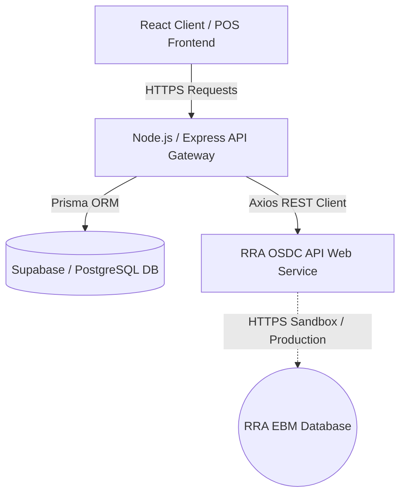

# KURI MACYE - E-COMMERCE & POS INVOICING SYSTEM
## RRA OSDC/VSDC Integration Technical Documentation

---

### Document Overview
* **System Name:** Kuri Macye Platform (E-Commerce Storefront & POS)
* **Integration Model:** Online Sales Data Controller (Online SDC / OSDC) API
* **Developer/Vendor:** Ubaka Tech Ltd (Benit Gilbert)
* **Target Audience:** Rwanda Revenue Authority (RRA) CIS/SDC Certification Team
* **Document Version:** 1.0.0
* **Date:** May 2026

---

## 1. System Overview

**Kuri Macye** is an enterprise-grade, cloud-native e-commerce storefront and Point of Sale (POS) system designed to optimize local commerce and retail operations in East Africa (specifically Rwanda). The platform operates under a multi-tenant model allowing local merchants to host storefronts, manage products, manage inventory, tracking shifts, and issue legally binding invoices to consumers.

To comply with the laws of the Republic of Rwanda regarding VAT collection and electronic invoicing, Kuri Macye integrates directly with the **Rwanda Revenue Authority (RRA) Electronic Billing Machine (EBM)** system using the Online Sales Data Controller (OSDC) web service API.

---

## 2. Technical Architecture

Kuri Macye uses a modern, high-performance web stack to ensure speed, security, and continuous service availability.



* **Frontend Framework:** React 19 single-page application (SPA), responsive and optimized for POS touch screens and mobile browsers.
* **Backend Runtime:** Node.js v20+ with Express 5 REST API framework.
* **Database & ORM:** PostgreSQL hosted on Supabase, managed via Prisma Object-Relational Mapper (ORM) for type-safe database schemas.
* **Integration Layer:** Axios HTTP client with cryptographic signature functions.

---

## 3. Database Schema for EBM Compliance

The database structure tracks EBM details at the individual order item level, ensuring that items from different sellers in a unified shopping cart are invoiced correctly under their respective RRA configurations.

### Database Models (Prisma Syntax)

```prisma
model Order {
  id              String      @id @default(uuid())
  publicId        String      @unique // Used as the hex identifier for invcNo
  totalAmount     Float
  paymentMethod   String      // e.g. "momo", "cash", "credit_card"
  shippingAddress Json        // Contains custTin, custNm, and delivery location
  items           OrderItem[]
  createdAt       DateTime    @default(now())
}

model OrderItem {
  id              String      @id @default(uuid())
  orderId         String
  order           Order       @relation(fields: [orderId], references: [id])
  productId       String
  productName     String
  quantity        Int
  price           Float
  sellerId        String      // Links item to specific seller's EBM config
  
  // RRA EBM Verification Fields
  ebmRcptNo       Int?        // Official RRA receipt number
  ebmInternalData String?     // Official RRA Internal Data signature
  ebmSignature    String?     // Official cryptographic receipt signature
  ebmQrCode       String?     // Formatted EBM QR code payload
  ebmDate         DateTime?   // Timestamp of RRA SDC acknowledgment
}

model User {
  id              String      @id @default(uuid())
  email           String      @unique
  role            String      // admin, seller, customer
  
  // Seller's RRA EBM SDC Configuration Details
  rraTin          String?     // Taxpayer Identification Number
  rraSdcId        String?     // SDC Identifier (Device ID)
  rraMrcNo        String?     // Machine Registration Number
  rraIntrlKey     String?     // Internal Key for local calculations
  rraSignKey      String?     // Signature Verification Key
}
```

---

## 4. OSDC API Integration & Endpoints

Kuri Macye integrates three key web service APIs provided by the RRA Sandbox and Production environments.

* **Sandbox Base URL:** `https://sdcsandbox.rra.gov.rw`
* **Production Base URL:** `https://api-ebm.rra.gov.rw`

### 4.1 Device Initialization
* **Endpoint:** `POST /initializer/selectInitInfo`
* **Purpose:** Authenticates the POS client and retrieves branch, tax configurations, and system keys.
* **Payload:**
```json
{
  "tin": "123456789",
  "bhfId": "00",
  "dvcSrlNo": "TEST-SERIAL-1234"
}
```

### 4.2 Product Item Registration
Before selling products on the storefront, items are registered with RRA.
* **Endpoint:** `POST /items/saveItems`
* **Payload:**
```json
{
  "tin": "123456789",
  "bhfId": "00",
  "itemClsCd": "50202201",
  "itemCd": "RW2NTBA5F12",
  "itemTyCd": "2",
  "itemNm": "Solar Lantern",
  "orgnNatCd": "RW",
  "pkgUnitCd": "NT",
  "qtyUnitCd": "U",
  "taxTyCd": "B",
  "dftPrc": 15000,
  "useYn": "Y",
  "regrNm": "Kuri Macye Platform",
  "regrId": "admin"
}
```

### 4.3 Sales Transaction Submission
* **Endpoint:** `POST /trnsSales/saveSales`
* **Payload:** Contains order metadata, totals, and an item list mapped to corresponding tax brackets.
* **Calculations for Tax Type B (Standard 18% VAT):**
  * Gross price is assumed VAT-inclusive.
  * $\text{Taxable Amount} = \text{Gross} \div 1.18$
  * $\text{VAT Amount} = \text{Gross} - \text{Taxable Amount}$
* **Payment Code Mapping:**
  * Cash $\rightarrow$ `01`
  * Credit $\rightarrow$ `02`
  * Card (Visa/Mastercard) $\rightarrow$ `05`
  * Mobile Money (MoMo) $\rightarrow$ `06`
  * Other $\rightarrow$ `07`

---

## 5. Cryptographic Signatures & QR Codes

### 5.1 Verification QR Code Generation
When a transaction completes successfully, the POS backend parses the OSDC response and generates a formatted verification string. This string is displayed on the receipt as a QR Code:
$$\text{QR Code Data} = \text{ddMMyyyy}\#\text{hhmmss}\#\text{sdcId}\#\text{rcptNo}\#\text{intrlData}\#\text{rcptSign}$$

* **ddMMyyyy / hhmmss:** Confirmation Date and Time.
* **sdcId:** The OSDC Device Identifier.
* **rcptNo:** Unique receipt serial number returned by RRA.
* **intrlData:** Cryptographic check value.
* **rcptSign:** Verification signature.

---

## 6. Offline Resiliency & Failover Handling

To ensure that network latency or RRA server timeouts never block a sale at the checkout counter, Kuri Macye utilizes a robust **Hybrid Failover Engine**:

1. **Network Timeout Window:** Outgoing API calls to RRA have a strict 10-second timeout.
2. **Local Signature Calculation (Simulation Mode):** If a network timeout or connection error occurs, the server logs a warning and dynamically generates a secure mock transaction signature locally using standard crypto functions:
   * **Internal Data Generation:** Secure 26-character random hex string.
   * **Signature Generation:** Secure 16-character random hex string.
3. **Queue Synchronization:** Transactions signed locally in offline/simulation mode are queued in the PostgreSQL database and retried via background synchronization cron jobs as soon as network reachability is restored.
